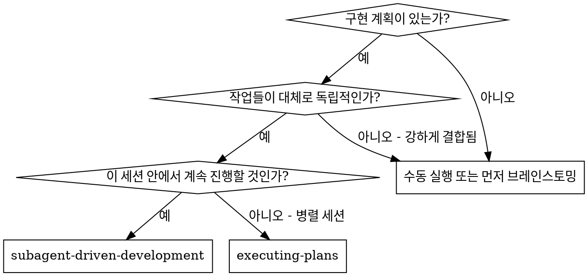
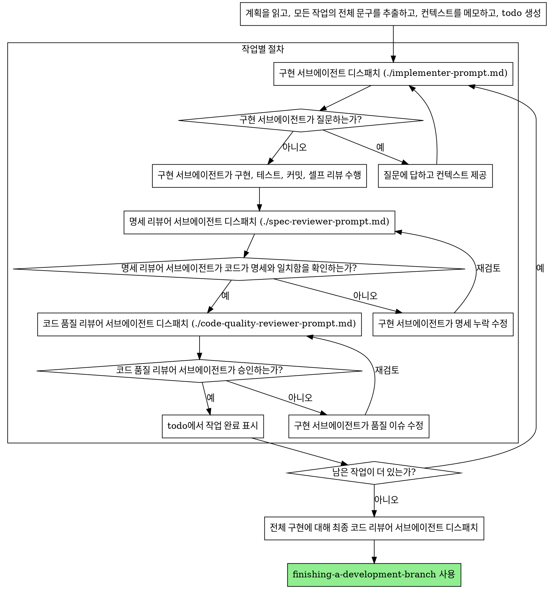

# 서브에이전트 주도 개발

계획의 각 작업마다 새로운 서브에이전트를 보내 실행하고, 각 작업 뒤에는 2단계 리뷰를 수행한다. 먼저 명세 준수 리뷰를 하고, 그다음 코드 품질 리뷰를 한다.

**왜 서브에이전트를 쓰는가:** 당신은 격리된 컨텍스트를 가진 전문 에이전트에게 작업을 위임한다. 지시사항과 컨텍스트를 정확하게 구성하면, 각 에이전트가 작업에 집중한 채 성공적으로 수행하도록 만들 수 있다. 이들은 현재 세션의 컨텍스트나 이력을 그대로 물려받아서는 안 되며, 필요한 정보만 당신이 직접 구성해 전달해야 한다. 이렇게 하면 조율 작업을 위한 당신 자신의 컨텍스트도 보존할 수 있다.

**핵심 원칙:** 작업마다 새로운 서브에이전트 + 2단계 리뷰(명세 후 품질) = 높은 품질과 빠른 반복

**브랜치 컨텍스트:** 이 스킬은 현재 체크아웃된 브랜치에서 바로 진행한다. 추가 브랜치 관리는 사용자가 수동으로 맡는다.

## 사용 시점



**Executing Plans(병렬 세션)와 비교하면:**
- 같은 세션에서 진행한다(컨텍스트 전환 없음)
- 작업마다 새로운 서브에이전트를 쓴다(컨텍스트 오염 없음)
- 각 작업 뒤에 2단계 리뷰를 한다: 먼저 명세 준수, 그다음 코드 품질
- 작업 사이에 사람 확인 단계를 두지 않아 반복이 더 빠르다

## 진행 절차



## 모델 선택

비용을 아끼고 속도를 높이기 위해, 각 역할을 처리할 수 있는 범위 안에서 가장 약한 모델을 사용한다.

**기계적인 구현 작업**(격리된 함수, 명확한 명세, 1~2개 파일): 빠르고 저렴한 모델을 사용한다. 계획이 잘 구체화되어 있다면 대부분의 구현 작업은 기계적이다.

**통합과 판단이 필요한 작업**(여러 파일 조율, 패턴 매칭, 디버깅): 표준 모델을 사용한다.

**아키텍처, 설계, 리뷰 작업**: 가장 성능이 좋은 모델을 사용한다.

**작업 복잡도 신호:**
- 완전한 명세와 함께 1~2개 파일만 건드린다 → 저렴한 모델
- 여러 파일을 건드리고 통합 이슈가 있다 → 표준 모델
- 설계 판단이나 넓은 코드베이스 이해가 필요하다 → 가장 성능이 좋은 모델

## 구현 담당 상태 처리

구현 서브에이전트는 네 가지 상태 중 하나를 보고한다. 각 상태에 맞게 처리한다.

**DONE:** 명세 준수 리뷰로 진행한다.

**DONE_WITH_CONCERNS:** 구현은 완료했지만 우려 사항을 표시했다. 다음 단계로 가기 전에 우려 내용을 읽는다. 우려가 정확성이나 범위에 관한 것이라면 리뷰 전에 먼저 해결한다. 단순 관찰(예: "이 파일이 너무 커지고 있다")이라면 메모만 남기고 리뷰로 진행한다.

**NEEDS_CONTEXT:** 제공된 정보가 부족해 구현을 진행할 수 없다. 빠진 컨텍스트를 제공하고 다시 디스패치한다.

**BLOCKED:** 구현 서브에이전트가 작업을 완료할 수 없다. 막힌 원인을 평가한다.
1. 컨텍스트 문제라면, 더 많은 컨텍스트를 제공하고 같은 모델로 다시 디스패치한다
2. 더 많은 추론이 필요한 작업이라면, 더 강한 모델로 다시 디스패치한다
3. 작업이 너무 크다면, 더 작은 단위로 나눈다
4. 계획 자체가 잘못되었다면, 사람에게 에스컬레이션한다

구현 서브에이전트의 에스컬레이션을 **절대** 무시하거나, 아무 변경 없이 같은 모델로 재시도시키지 않는다. 구현 서브에이전트가 막혔다고 했다면, 무언가는 바뀌어야 한다.

## 프롬프트 템플릿

- `./implementer-prompt.md` - 구현 서브에이전트 디스패치
- `./spec-reviewer-prompt.md` - 명세 준수 리뷰어 서브에이전트 디스패치
- `./code-quality-reviewer-prompt.md` - 코드 품질 리뷰어 서브에이전트 디스패치

## 예시 워크플로

```
You: 이 계획을 실행하기 위해 Subagent-Driven Development를 사용하겠습니다.

[계획 파일을 한 번 읽기: docs/plans/feature-plan.md]
[모든 작업 5개의 전체 문구와 컨텍스트 추출]
[모든 작업으로 todo 생성]

작업 1: Hook installation script

[작업 1의 문구와 컨텍스트 가져오기(이미 추출됨)]
[전체 작업 문구 + 컨텍스트와 함께 구현 서브에이전트 디스패치]

Implementer: "시작하기 전에 확인이 필요합니다 - hook을 사용자 수준에 설치해야 하나요, 시스템 수준에 설치해야 하나요?"

You: "사용자 수준입니다 (~/.config/hooks/)"

Implementer: "확인했습니다. 지금 구현하겠습니다..."
[잠시 후] Implementer:
  - install-hook command 구현
  - 테스트 추가, 5/5 통과
  - 셀프 리뷰: --force 플래그를 빼먹은 것을 발견해 추가함
  - 커밋 완료

[명세 준수 리뷰어 디스패치]
Spec reviewer: ✅ 명세 준수 - 모든 요구사항 충족, 불필요한 추가 없음

[git SHA를 구하고 코드 품질 리뷰어 디스패치]
Code reviewer: Strengths: 테스트 커버리지가 좋고 코드가 깔끔함. Issues: 없음. Approved.

[작업 1 완료 표시]

작업 2: Recovery modes

[작업 2의 문구와 컨텍스트 가져오기(이미 추출됨)]
[전체 작업 문구 + 컨텍스트와 함께 구현 서브에이전트 디스패치]

Implementer: [질문 없이 진행]
Implementer:
  - verify/repair 모드 추가
  - 테스트 8/8 통과
  - 셀프 리뷰: 이상 없음
  - 커밋 완료

[명세 준수 리뷰어 디스패치]
Spec reviewer: ❌ Issues:
  - 누락: 진행 상황 보고 (명세에는 "100개마다 보고"라고 되어 있음)
  - 추가됨: --json 플래그 추가됨(요청되지 않음)

[Implementer가 이슈 수정]
Implementer: --json 플래그 제거, 진행 상황 보고 추가

[Spec reviewer가 다시 검토]
Spec reviewer: ✅ 이제 명세 준수

[코드 품질 리뷰어 디스패치]
Code reviewer: Strengths: 탄탄함. Issues (Important): 매직 넘버(100)

[Implementer가 수정]
Implementer: PROGRESS_INTERVAL 상수 추출

[Code reviewer가 다시 검토]
Code reviewer: ✅ 승인

[작업 2 완료 표시]

...

[모든 작업이 끝난 후]
[최종 reviewer 디스패치]
Final reviewer: 모든 요구사항 충족, 머지 준비 완료

완료!
```

## 장점

**수동 실행과 비교하면:**
- 서브에이전트는 자연스럽게 TDD를 따른다
- 작업마다 새로운 컨텍스트를 쓴다(혼란 감소)
- 병렬 안전하다(서브에이전트끼리 간섭하지 않음)
- 서브에이전트가 작업 전뿐 아니라 작업 중에도 질문할 수 있다

**Executing Plans와 비교하면:**
- 같은 세션에서 진행한다(핸드오프 없음)
- 진행이 끊기지 않는다(대기 시간 없음)
- 리뷰 체크포인트가 자동으로 들어간다

**효율성 이점:**
- 파일을 읽는 오버헤드가 없다(컨트롤러가 전체 문구를 제공함)
- 컨트롤러가 어떤 컨텍스트가 필요한지 정확히 선별한다
- 서브에이전트는 시작 전에 필요한 정보를 완전하게 받는다
- 질문이 작업 시작 후가 아니라 시작 전에 드러난다

**품질 게이트:**
- 셀프 리뷰가 핸드오프 전 이슈를 먼저 잡아낸다
- 2단계 리뷰: 명세 준수 후 코드 품질
- 리뷰 루프가 수정이 실제로 작동하는지 확인한다
- 명세 준수 검토가 과잉 구현과 과소 구현을 막는다
- 코드 품질 검토가 구현의 완성도를 보장한다

**비용:**
- 더 많은 서브에이전트 호출이 필요하다(작업마다 구현자 + 리뷰어 2명)
- 컨트롤러의 사전 준비 작업이 늘어난다(모든 작업을 미리 추출해야 함)
- 리뷰 루프 때문에 반복 횟수가 늘어난다
- 하지만 문제를 초기에 잡아내므로, 나중에 디버깅하는 것보다 더 저렴하다

## 위험 신호

**절대 하지 말 것:**
- 명시적인 사용자 동의 없이 main/master 브랜치에서 구현을 시작하지 않는다
- 리뷰를 생략하지 않는다(명세 준수 또는 코드 품질)
- 수정되지 않은 이슈를 남긴 채 진행하지 않는다
- 여러 구현 서브에이전트를 병렬로 보내지 않는다(충돌 위험)
- 서브에이전트에게 계획 파일을 직접 읽게 하지 않는다(대신 전체 문구를 제공한다)
- 장면 설정용 컨텍스트를 생략하지 않는다(서브에이전트는 작업의 위치를 이해해야 한다)
- 서브에이전트의 질문을 무시하지 않는다(진행시키기 전에 답한다)
- 명세 준수에서 "거의 맞음"을 받아들이지 않는다(명세 리뷰어가 이슈를 찾았다면 끝난 것이 아님)
- 리뷰 루프를 생략하지 않는다(리뷰어가 이슈를 찾으면 구현자가 수정하고 다시 리뷰받아야 함)
- 구현자의 셀프 리뷰로 실제 리뷰를 대체하지 않는다(둘 다 필요하다)
- **명세 준수 리뷰가 ✅ 되기 전에 코드 품질 리뷰를 시작하지 않는다** (순서가 잘못됨)
- 둘 중 어느 리뷰라도 열린 이슈가 남아 있는데 다음 작업으로 넘어가지 않는다

**서브에이전트가 질문하면:**
- 명확하고 충분하게 답한다
- 필요하면 추가 컨텍스트를 제공한다
- 서둘러 구현부터 하게 만들지 않는다

**리뷰어가 이슈를 찾으면:**
- 구현자(같은 서브에이전트)가 수정한다
- 리뷰어가 다시 검토한다
- 승인될 때까지 반복한다
- 재검토를 건너뛰지 않는다

**서브에이전트가 작업에 실패하면:**
- 구체적인 지시와 함께 수정용 서브에이전트를 보낸다
- 직접 수동으로 고치려 들지 않는다(컨텍스트 오염)

## 통합

**관련 워크플로 스킬:**
- **writing-plans** - 이 스킬이 실행할 계획을 만든다
- **requesting-code-review** - 리뷰어 서브에이전트용 코드 리뷰 템플릿을 제공한다
- **finishing-a-development-branch** - 모든 작업 후 개발을 마무리한다

**서브에이전트가 사용해야 하는 것:**
- **test-driven-development** - 서브에이전트는 각 작업마다 TDD를 따른다

**대안 워크플로:**
- **executing-plans** - 같은 세션 실행 대신 병렬 세션이 필요할 때 사용한다
